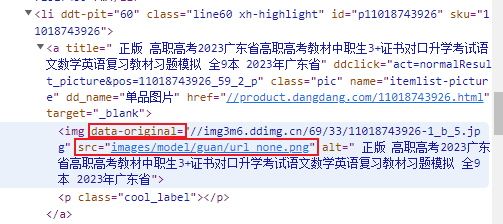
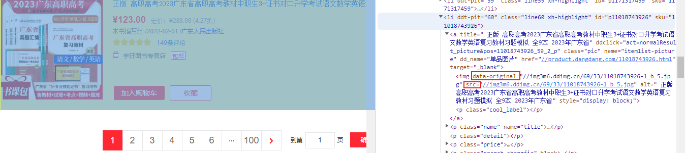

## 企业级数据挖掘爬虫scrapy

### 安装scrapy

在cmd执行
~~~shell
pip install scrapy -i https://pypi.douban.com/simple
~~~

### 使用scrapy
##### 1 创建scrapy项目
~~~shell
# scrapy startproject （当前路径下）项目名
# 注意：项目的名字不允许使用数字开头、不能包含中文
scrapy startproject scrapy_spider
~~~

##### 2 创建爬虫文件
~~~shell script
# 要在spiders文件夹中创建爬虫文件
# cd 项目名\项目名\spiders
cd scrapy_spider\scrapy_spider\spiders
# 创建爬虫文件
# scrapy genspider 爬虫文件名 爬取网页（不加http协议）
scrapy genspider baidu www.baidu.com
~~~

##### 3 写爬虫脚本
```shell script
# 3.1 start_urls最后的反斜线/需要去掉
# 3.2 在items.py中定义需要获取的数据，如src = Field()
# 3.3 xpath解析获取数据
src = response.xpath(//*[@id="component_59"]/li//img/@src).extract_first()
# 3.4 将获取到的数据交给管道pipelines
yeild src
# 3.5 在settings中开启管道，默认优先级是300，可根据需要调整
ITEM_PIPELINES = {
    'scrapy_dangdang.pipelines.ScrapyDangdangPipeline': 300,
}
# 3.6 在pipelinse.py中定义数据处理逻辑，包括保存、下载等操作
def open_spider(self,spider):
    self.fp = open('xxx','w',encoding='utf-8')
def process_item(self, item, spider):
    self.fp.write(str(item))

def close_spider(self,spider):
    self.fp.close()

# 3.7 多管道开启，模仿默认的管道，在settings.py中开启管道，并定义class类，自带def process_item(self, item, spider):..return
def process_item(self, item, spider):
    url = f'http:{item.get("src")}'
    filename = f'./books/{item.get("name")}.jpg'

    urllib.request.urlretrieve(url=url,filename=filename)
    return item
# 3.8 在settings.py中开启管道
ITEM_PIPELINES = {
   'scrapy_dangdang.pipelines.ScrapyDangdangPipeline': 300,
   'scrapy_dangdang.pipelines.DangDangDownloadPipeline': 301,
}

# 3.9 如需开启多页下载，则在逻辑中再次调用parse方法即可
if self.page < 100:
    # scrapy.Request就是scrapy的get请求
    # url就是请求地址
    # callback是要执行的函数parse，注意不要加()
    self.page = self.page + 1
    url = self.base_url + str(self.page) + 'xxx'
    yield scrapy.Request(url=url,callback=parse)
```

##### 4 运行爬虫代码
```shell script
# scrapy crawl 爬虫文件名
scrapy crawl baidu
# 注意：如果将setting.py中的“ROBOTSTXT_OBEY = True”注释掉后，会将robot.txt不允许爬取的协议忽略掉
```

### scrapy项目结构
```text
项目名称
    项目名称
        spiders文件夹（存储爬虫文件）
            init
            自定义爬虫文件 核心功能文件
        init
        items   定义数据结构的地方，爬取的数据都包含哪些
        middleware  中间件 代理
        pipelines   管道  用来处理下载的数据 默认是300优先级，值越小优先级越高（1-1000）
        settings    配置文件    robots协议 ua定义等

```

### response返回对象的属性和方法
```text
response.text   获取响应的字符串
response.body   获取的是二进制数据
response.xpath  直接使用xpath来解析response的内容
response.extract()  提取seletor对象的data属性值
response.extract_first() 提取seletor列表的第一个数据
```

### scrapy shell
```shell script
# scrapy shell是一个交互终端，用于未启动spider时进行尝试和调试代码
# 测试xpath或css表达式，免去每次修改后运行spider的麻烦
# 安装ipython，可以智能补全和高亮输出等特性
pip install ipython

# 使用scrapy shell：scrapy shell url
scrapy shell http://category.dangdang.com

# response对象
response.body
response.text
response.url
response.status

# response解析
response.xpath() 
```

### 反爬懒加载
```shell script
# 对于获取到的数据，如果发现url都一样，那么基本判定为懒加载的原因
# 解决方式：将对应标签如li标签拉到最后一个，查看对应属性是否有类似data-original="..."，那么这个属性才是真正想要获取的
# 具体实例如下：
```

```shell script
# 1 如上图：懒加载状态下，src为：images/model/guan/url_none.png
# 2 如下图：页面和标桩都拉到最后时，数据正式加载，src变成与data-orginal一样
# 3 真正src的属性是data-orginal
# 4 注意项：对于第一个标签数据，因为不含懒加载，没有data-original，所以还是src
```

